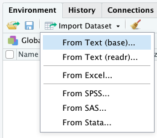

```{r setup, include=FALSE}
knitr::opts_chunk$set(echo = TRUE)
options("yaml.eval.expr" = TRUE)
```

# 1.8. Entrada de Datos al Sistema
> R es muy versátil en cuanto a las fuentes de datos que pueden traerse al ambiente de computación.  

Aparte de la entrada manual de datos, por ejemplo utilizando vectores para crear luego matrices o _data frames_, hay procedimientos para importar datos de diferentes fuentes y sus formatos.  
RStudio provee el menú __Import Dataset__ para diversos tipos de archivos desde los cuales importar datos al sistema.  Más adelante utilizaremos uno de ellos.

   

## 1.8.1. Entrada de datos manuales con un editor del sistema  
__Al finalizar esta sección podrás entrar y editar datos usando un editor del sistema.__  

Una manera de realizar la entrada manual de datos en R, es usando un editor mediante la función __edit__.  Esta función trabaja en R solamente, por lo cual debemos usarla en la __Console__.

```{r}
# creamos la estructura del data frame sin datos
misdatos <- data.frame(id = character(0), altura = numeric(0))
# para iniciar la entrada de datos manuales podemos escribir en la consola:
# misdatos <- edit(misdatos)
# al terminar se hace clic en Quit
# revisamos si tenemos los datos
misdatos
# si queremos continuar entrando datos o editando usamos:
# misdatos <- edit(misdatos) en la consola
```

Este método es fácil y rápido cuando se tienen pocos datos y no están en un documento digital.  Cuando los datos son muchos, y se encuentran en un documento digital, es conveniente usar los procedimientos que se describen a continuación, para algunos formatos digitales.  

\

[  __Home__](https://dsfernandez.github.io/tallerR-basico/index.html) 

***  

## 1.8.2.  Datos contenidos en paquetes.  
__Al completar esta sección podrás traer al sistema datos que se encuentran encapsulados en paquetes.__  

Algunos paquetes pueden contener datos para ser utilizados como ejemplos para conocer las funcionalidades del paquete o simplemente son paquetes de datos reusables.  A continuación utilizaremos el paquete __healthcareai__ para mostrar como obtener los datos contenidos en el mismo.  Los datos a utilizar corresponden a un estudio de salud, realizado en 768 mujeres de más de 21 años, del grupo indígena Pima ( _Akimel O'odham_) del sur de Arizona y noroeste de México.
```{r data-pack, message=FALSE, warning=FALSE}
# activar el paquete healthcareai previamente instalado
library(healthcareai)
# obtener la lista de datos que contiene el paquete
data(package = "healthcareai")
```
Data sets in package ‘healthcareai’:

pima_diabetes     Patient diabetes dataset  
pima_meds         Patient medications dataset

Una vez activado el paquete con __library__, los datos del mismo están disponibles, y podemos visualizarlo y usarlos para análisis.
```{r data-head}
# la función head muestra las primeras 6 filas de datos
head(pima_diabetes)
```
\

[  __Home__](https://dsfernandez.github.io/tallerR-basico/index.html)  

***  

## 1.8.3. Datos en archivos del sistema (.Rdata)  
__Al finalizar esta sección podrás guardar y cargar al sistema el contenido de un archivo .Rdata__  

R provee una manera muy práctica de guardar varios objetos del sistema en un solo archivo usando la función __save__.  Este tipo de archivo puede luego ser cargado al sistema en un solo paso usando la función __load__.  A continuación vamos a crear un archivo .Rdata y luego cargarlo al sistema.
```{r rdata}
# vector vc
vc <- c(1:20)
# matriz mx
mx <- matrix(1:9, nrow = 3, byrow = TRUE)
# resultado de función trigonométrica
ft <- sin(pi/2)
# guardar como .Rdata
save(mx, vc, ft, file = "data/archivo.Rdata")
# borramos los objetos guardados en la memoria del sistema
rm(mx,vc,ft)
# cargamos el archivo creado y vemos su contenido
print(load("data/archivo.Rdata"))
```
\

[  __Home__](https://dsfernandez.github.io/tallerR-basico/index.html) 

***  

## 1.8.4. Importar datos desde un archivo en formato de texto delimitado.  
__Al completar esta sección podrás importar datos de documentos en formato .csv y similares__  

Una manera de guardar datos, que puedan ser utilizados por diferentes programas o lenguajes, es mediante archivos de texto delimitado.  Este tipo de archivo utiliza menos memoria y no tienen incorporadas peculiaridades de formato, específicas de los programas que los generan.  
Para importar datos de estos archivos podemos utilizar la función genérica __read.table__, usando el argumento __sep = ","__ para indicar que se trata de datos separados por coma.  El objeto resultante es un _data frame_.  El archivo que vamos a usar en este ejemplo es: [death_small_cities.csv](https://drive.google.com/file/d/1WrSYD5i9W4WggWtFdfhH2capF8tRD98R/view?usp=sharing) 

```{r}
# usamos read.table y los parámetros header y sep
mort_ciudades <- read.table("data/death_small_cities.csv",
                            header = TRUE,
                            sep = ",")
# para ver las primeras 10 filas de datos en el archivo
head(mort_ciudades, 10)
```
\

Para separar datos delimitados por tabuladores ( _tabs_), usamos __sep = "\t"__.  Si el archivo no contiene nombres de las variables en la primera línea, se pueden agregar usando el argumento __col.names = vector-con-los-nombres__.  
La función __read.csv__ también se usa para importar datos delimitados, y está basada en __read.table__, pero es exclusiva para datos separados por coma (archivos que tienen la extensión _.csv_).
```{r}
mort_ciudades2 <- read.csv("data/death_small_cities.csv")
# para ver las primeras 10 líneas de datos
head(mort_ciudades2, 10)
```
\

### Copiar datos desde una tabla  
> Al estilo _Copy & Paste_

La función __read.table__ permite pegar ( _paste_) la información que se encuentra en el _clipboard_ luego de copiar ( _copy_) desde una tabla u hoja de cálculo, Excel por ejemplo.  
```{r eval=FALSE, message=FALSE, warning=FALSE, include=TRUE}
pegar <- read.table(file = "clipboard", 
                    sep = "\t", 
                    header = TRUE)
```
\

[  __Home__](https://dsfernandez.github.io/tallerR-basico/index.html)  
\

***  

## 1.8.5. Importar desde hojas de cálculos.  
__Al finalizar esta sección podrás importar datos de hojas de cálculo, como Excel, usando menú y códigos R.__  

Para importar datos de algún programa de hoja de cálculo (Excel, OpenOffice, Google Sheets) la manera estándar consiste en exportar los datos a un archivo en formato .csv _(comma separated values)_, y luego importarlo a R usando __read.csv__.  Existen paquetes que proveen funciones para importar datos desde archivos Excel, uno de ellos, y asociado a RStudio es __readxl__; se puede usar en código o mediante el menú __Import Dataset__.  

### Paquete readxl y función read_excel(..)    
> Combinación de menú y código para importar datos desde Excel  

Antes de iniciar el proceso de importar debe estar instalado el paquete __readxl__, siguiendo el procedimiento que se describió anteriormente.  En una página _R Script_ o en la consola, activamos el paquete usando __library(readxl)__.

Debemos asegurar que el archivo que vamos a importar se encuentre en el directorio de trabajo o uno conocido.  A continuación un enlace para descargar el archivo del ejemplo de esta sección:  

[death_small_cities.xlsx](https://drive.google.com/file/d/1JRiaetErrpQVG5ZKNEeoH8rxleH8iDB5/view?usp=sharing)

Ahora utilizaremos el menú __Import Dataset__ en la ventana __Environment__:  

* Hacer clic en __From Excel...__ y se abrirá la ventana de importación.  

*  Lo primero es localizar el archivo a importar, usando __Browse...__, y si el archivo se encuentra en el directorio de trabajo, este debe aparecer en la lista de archivos disponibles, o dentro de una de las carpetas de este directorio.  

*  Una vez seleccionado el archivo, tus datos deben aparecer dentro de la ventana de importación.  Si no aparecen los datos que esperas, verifica en __Sheet:__ si tienes seleccionada la hoja de datos que deseas.

*  Verifica si aparecen los nombres de las columnas, y si los datos son de la clase que se esperan ( _numeric_ y _double_, o _character_).  Si los nombres de la columnas no aparecen como se esperan, verificar que __First Row as Names__ esté marcado.  

*  Puedes cambiar el nombre del _data.frame_ que vas a crear, usando __Name:__.  

*  Quita la marca de __Open Data Viewer__, y copia el código que se encuentra en la ventana de __Code Preview:__, y pégalo en tu _R Script_.  

*  Corre el código copiado, y usando __head(nombre_de_data.frame)__ debes poder ver las seis primeras filas de datos de tu _data frame_.  

VIDEO  
\

```{r}
# activación del paquete
library(readxl)
# código de carga de datos del archivo
mort_ciudades3 <- read_excel("data/death_small_cities.xlsx", 
    sheet = "data")
head(mort_ciudades3, 10)
```


[  __Home__](https://dsfernandez.github.io/tallerR-basico/index.html)  
\

***

## 1.8.6. Importar datos de la _web_  
__Al finalizar esta sección podrás importar datos de sitios en la _web_ que provean acceso a archivos de datos__  

Algunos sitios públicos de la _web_ permiten descargar algunos de sus datos.  Podemos utilizar el enlace ( _URL_) para descargar los datos directamente a nuestro ambiente de trabajo.  Usaremos como ejemplo, datos disponibles en la página del CDC - National Center for Health Statistics (https://data.cdc.gov/NCHS/), y específicamente los datos provisionales de muertes asociadas a COVID-19, por edad, sexo y estado o territorio.  El paquete __rio__ provee la función __download.file__ para realizar la descarga de un archivo en formato .csv, que luego podemos cargar al sistema con __read.csv__

```{r}
# activar rio
library(rio)
# copiar la dirección del archivo obtenidad de la página web
covid <- "https://data.cdc.gov/api/views/9bhg-hcku/rows.csv?accessType=DOWNLOAD"
# descargar los datos con download.file
download.file(covid, "data/coviddata.csv")
# importar los datos al sistema usando read.csv
coviddeath <- read.csv("data/coviddata.csv")
# primeras 6 filas de los datos
head(coviddeath)
```

\

[  __Home__](https://dsfernandez.github.io/tallerR-basico/index.html) 

***  


