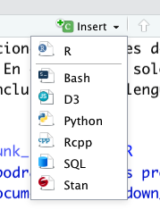
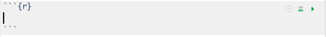
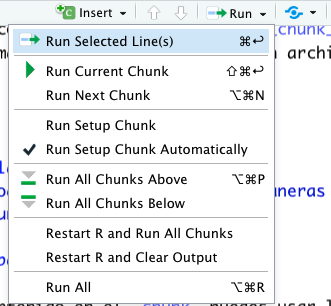
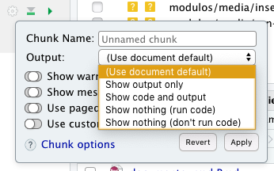

```{r setup, include=FALSE}
knitr::opts_chunk$set(echo = TRUE)
```

# 3.3. Códigos R en Documento R Markdown  

Con el paquete __rmarkdown__ puedes crear documentos de análisis dinámicos que combinan código, comandos interpretables (como figuras) y texto redactado. Cuando se interpreta un archivo .Rmd, R Markdown ejecutará cada fragmento de código y colocará los resultados debajo del fragmento de código en su informe final.  

Los fragmentos de códigos que se incluyen en el documento base .Rmd, deben incluirse en secciones especiales del documento, que se denominan ___chunks_ __.  En este taller solo tratamos los _chunks_ de R, pero pueden incluirse otros lenguajes como Python.  

## 3.3.1. Creación de un _chunk_ de código R  
__Al finalizar esta sección podrás crear tus propias secciones de código R (_chunks_), en un documento R Markdown__  

Puedes insertar un fragmento de código R usando la barra de herramientas RStudio (el botón __Insert__) o el atajo de teclado _Ctrl + Alt + I_ (_Cmd + Opción + I_ en macOS).    
\

  
\  
### Partes de un _chunk_  

Un _chunk_ está delimitado por tres acentos graves (__``` __), al inicio y final del mismo.  
\

  
\  

Además de los indicadores de inicio y fin, el _chunk_ posee otros componentes:  

* un área de __opciones de control__ mediante comandos, que van dentro de __{r "aquí van opciones de control"}__.  
* tres __íconos para control manual__ del _chunk_: indicar opciones de los productos del _chunk_; correr _chunks_ anteriores; correr el _chunk_.   
* área del __código R__. que se puede correr por línea o secciones con el menú __Run__ en la barra de herramientas del documento.  

El código R que se escriba o copie al área de código del _chunk_ sigue las mismas reglas y formato del código escrito en un archivo de código regular (R Script).  

\

## 3.3.2. Correr y Controlar la Salida de un _chunk_.
__Al finalizar esta sección podrás correr de diferentes maneras y controlar la salida de un _chunk_ de R__  

### Correr el código total o parcialmente  

Para correr todo el código contenido en el _chunk_ puedes usar la cabeza de flecha verde (parte superior derecha del _chunk_).  Para correr solo una parte del código, puedes marcar el código a correr y usar el menú __Run__, en la barra de herramientas del documento R Markdown.  Este menú también tiene otras opciones para correr el código.  
\

  

\

### Controles de salidas o producción del _chunk_  

El comportamiento y producción de resultados y mensajes del _chunk_ puede controlarse mediante opciones escritas en la zona entre llaves (__{r "opciones"}__) o usando el menú del ícono de engranaje del _chunk_:  
\

  

\

Aquí se puede controlar si aparecen mensajes o avisos de los paquetes, si se quiere que el código aparezca en la salida o sólo el resultado. 


