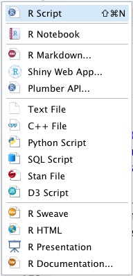
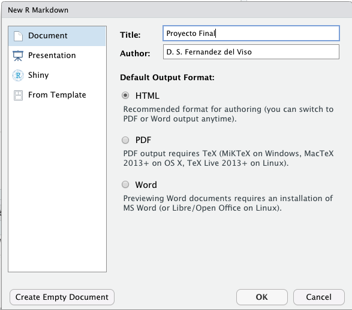
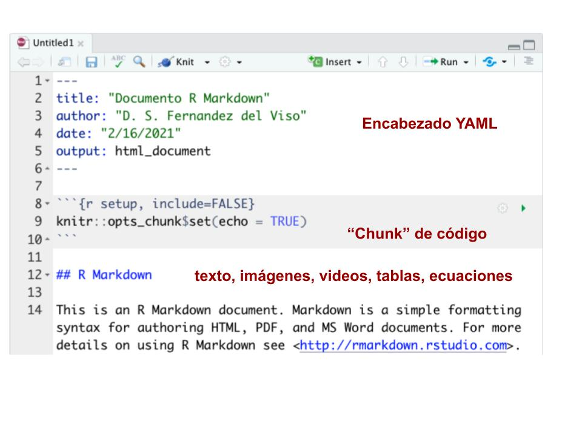

```{r setup, include=FALSE}
knitr::opts_chunk$set(echo = TRUE)
```

# 3.1.Documento R Markdown  
Tan importante como realizar el análisis de datos de una investigación, también lo es comunicar los resultados a una audiencia, y recibir reconocimiento y comentarios sobre los mismos.  En RStudio tenemos una manera de hacer todo lo anterior, utilizando documentos __R Markdown__.  

## 3.1.1. Archivo R Markdown en RStudio  
__Al finalizar esta sección podras crear y preparar el formato general de un documento R Markdown__  

### Preparación para documento R Markdown  

Primero, comprueba si tienes instalado el paquete __rmarkdown__; para ello, busca en el menú de __Packages__ (_User Library_).  Si no lo tienes, puedes instalarlo de la manera usual, con __Install__, o usando la consola: __install.packages('rmarkdown')__.  

> __Documentos PDF__  

Para generar documentos PDF es necesario tener instalado __LaTex__ en la computadora, o usar __TinyTex__ con el paquete __tinytex__.  

> __Documentos Word__  
 
Requiere tener una licencia autorizada de Word.  

\

### Abrir documento R Markdown  

Para crear un documento de R Markdown, usa el menú de la esquina superior izquierda, del panel de RStudio:  

\ 

  

\

Se abrirá una ventana (si no tienes instalado __rmarkdown__ te aparecerá un mensaje):  

\



\

en la que puedes poner un título de lo que vas a trabajar en el documento y pulsar __OK__.

El documento que se abre tiene esta forma, usualmente:  

\



Un __documento R Markdown__ contiene tres elementos principales:  

> El encabezado __YAML__ o __metadata__ controla la configuración general del documento R Markdown.  
> Los __"chunks"__ de código R (también pueden incluirse otros lenguajes) permiten incluir códigos dentro del documento, que corren de manera independiente y controlable.  
> El __área de edición__ de texto, imágenes, videos, tablas, enlaces, ecuaciones, et c.  

\

### Metadata YAML  

La metadata para R Markdown se puede escribir al principio de un documento, comenzando y terminando con tres guiones __- - -__, respectivamente. Los metadatos YAML suelen constar de pares etiqueta-valor separados por dos puntos (:).  Es importante la indentación:  

Las siguientes instrucciones jerarquizadas, no funcionan si se escriben así:  

| output:  
| html_document:  
| toc: yes    
\
Para que funcionen deben escribirse:  

| output:   
|    html_document:  
|      toc: yes  
\  

> Título del documento  

Las etiquetas __title:__, __author:__ y __date:__ sirven para crear un título del documento con un nombre del documento, nombre del autor y la fecha de creación.  

> Documento final  

El documento final a producir puede indicarse con la etiqueta __output:__, y entre toros podemos crear:  

* página HTML para la web: __html_document__  
* documento Word: __word_document__  
* documento PDF: __pdf_document__  

> Opciones para los documentos finales  

Dentro de cada etiqueta de documento se pueden incluir otras sub-etiquetas que determinan opciones de formato del documento, como:  

*  __css:__ para usar un archivo de comandos CSS que sirve para indicar tipo de letra, tamaño, colores, et c., en el documento final HTML,    
*  __toc:__ para producir una tabla de contenido.  


