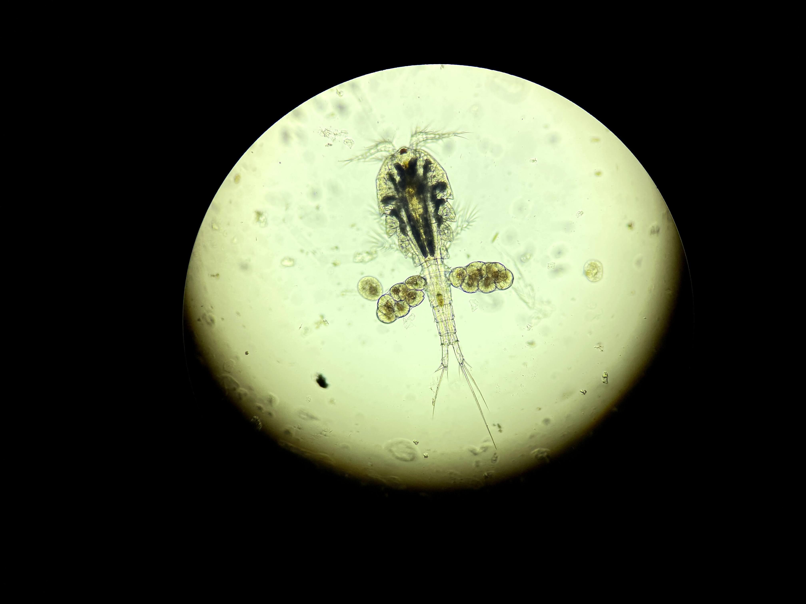

```{r setup, include=FALSE}
knitr::opts_chunk$set(echo = TRUE)
```

# 3.2. Edición de Documento R Markdown  

El documento que escribimos en RStudio eventualmente será procesado para producir un documento en formato final (HTML. Word, PDF) utilizando el programa __pandoc__, incluido en la instalación de RStudio.  Pandoc transforma diferentes códigos e instrucciones de formato, que escribimos en el documento original R Markdown, por lo tanto debemos conocer algunas de esas instrucciones para obtener el documento que queremos.  

## 3.2.1. Control y edición del texto del documento  
__Al finalizar esta sección podrás incluir y editar texto y ecuaciones para tu publicación final__  

Al escribir texto, debes dar dos espacios al final de un párrafo, para separarlo del siguiente.

> Títulos

Para títulos de párrafos y secciones podemos controlar el tamaño del texto usando __#__; uno produce el máximo tamaño, dos un poco más pequeño, y así sucesivamente hasta seis:  

    # Título
    ## Subtítulo
    ### Sección
    #### Subsección  
    
# Título
## Subtítulo
### Sección
#### Subsección

> Resaltado (_bold_) e itálica  

Para resaltar se puede usar `__resaltado__` o `**resaltado**`:  

__resaltado__  
**resaltado**

Para itálica se puede usar `_itálica_` o `*itálica*`:  

_itálica_  
*itálica*  


> Ecuaciones  

R Markdown acepta el lenguaje [LaTex](https://www.rpi.edu/dept/arc/docs/latex/latex-intro.pdf) para escribir terminología matemática y ecuaciones.  Estas pueden aparecer aisladas y centradas, usando __$$__: 

`$$\frac{dN}{dt} = r_{max}N(1 - \frac{N}{K})$$`

$$\frac{dN}{dt} = r_{max}N(1 - \frac{N}{K})$$

`$$\hat Y = \alpha + \beta*X + \gamma*X^2$$`

$$\hat Y = \alpha + \beta*X + \gamma*X^2$$

También pueden introducirse en el texto, usando un __$__:  

`El nivel de significancia es $\alfa = 0.05$, para esta prueba.`  
    
El nivel de significancia es $\alpha = 0.05$, para esta prueba.  

> Listas indentadas (_bullets_)  

Para crear una lista indentada (_bulleted list_) de tres niveles usamos __* __, __+ __ y __-- __, con la tecla de _tab_ para indentar; al final de cada línea debemos dar dos espacios:  

    * lista no numerada  
    [tab]  + sub-item 1
    [tab]  + sub-item 2
    [tab][tab] - sub-sub-item   

* lista no numerada  
  + sub-item 1  
  + sub-item 2  
    - sub-sub-item   
    
En el caso de una lista numerada:  
  
    1. lista numerada  
    [tab]  i) sub-item 1
    [tab]  ii) sub-item 2
    [tab][tab] A. sub-sub-item  
    
1. lista numerada    
  i) sub-item 1  
  ii) sub-item 2  
    A. sub-sub-item   
    
## 3.2.2. Inserción y edición de enlaces e imágenes en el documento  
__Al finalizar esta sección podrás incluir y editar enlaces e imágenes para tu publicación final__  

### Enlaces a páginas de la _web_  

Dentro del documento R Markdown podemos incluir una línea de comando que creará un enlace a un sitio de la _web_, con el nombre que desees o el enlace exacto.  

> Enlace original  

`<https://rstudio.com/>`

<https://rstudio.com/>

> Enlace con nombre  

`[RStudio](https://rstudio.com/)`  

[RStudio](https://rstudio.com/)  
\

### Inserción de imágenes  

Para insertar una imágen, que se encuentra en el directorio de trabajo, usamos el siguiente código:  

``  

  

El nombre de la imagen se puede eliminar, pero deben quedar los corchetes: __[] __. 
\

> El tamaño de la imagen se puede editar:  

`{width=50px}`  

{width=50px}

También se puede usar:  

`{width=50%}`  

{width=50%} 