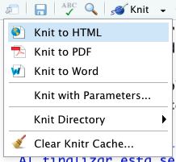
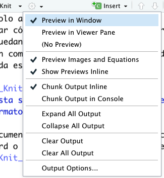

```{r setup, include=FALSE}
knitr::opts_chunk$set(echo = TRUE)
```

# 3.4. Producción de Documento en Formato de Publicación  

Puedes usar un solo archivo R Markdown tanto para 
guardar y ejecutar código, como para generar informes de alta calidad que se puedan compartir con tu audiencia.  Los documentos de R Markdown son completamente reproducibles y admiten docenas de formatos de salida estáticos y dinámicos.

El proceso detrás de la transformación del archivo .Rmd a documentos finales de diversos formatos y estilos, es uno complejo, por los pasos y paquetes y programas que requiere (__rmarkdown__, __knitr__, __Pandoc__), pero RStudio, y R Markdown simplifican ese proceso, en lo que alguien ha descrito como "arte de magia":  
\


\


# 3.4.1. Uso de R Markdown para Producir Documentos  
__Al finalizar esta sección podrás producir documentos finales en al menos tres formatos__  

### Usando el menú __Knit__

El paso de un documento R Markdown (.Rmd) a un documento en formato HTML, Word o PDF se realiza de manera directa en RStudio usando el menú __Knit__:  
\



\

### Usando la consola  

El procedimiento se puede realizar en la consola usando el siguiente comando y formato:  

> __rmarkdown::render('archivo.Rmd', 'FORMATO_document')__   

donde _FORMATO_ puede ser __html__, __word__, o __pdf__.  

\  

### Ajustes y controles del documento de salida  

El siguiente menú provee diversas formas de modificar el documento de salida y la manera de visualizar el mismo:  
\

  


