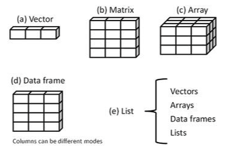

```{r setup, include=FALSE}
knitr::opts_chunk$set(echo = TRUE)
options("yaml.eval.expr" = TRUE)
```

# 1.7. Estructuras de Datos  
> Diversas estructuras de datos para diferentes usos y paquetes del sistema.  

\

  
\

## 1.7.1. Vectores  
__Al completar esta sección podrás crear vectores y manipular los datos contenidos en ellos.__  

Un vector es un arreglo unidimensional que puede contener datos numéricos, textuales, y lógicos.  Para construirlos se utiliza la función de construcción __c__.  
```{r}
# datos numéricos
vec.num <- c(1, 2, 5, 3, 6, -2, 2.3)
vec.num
class(vec.num)
# datos caracteres
vec.car <- c("uno", "dos", "tres")
vec.car
# combinando números y texto, todos se convierten a texto:
vec.combo <- c(3, 5, 7, "tres", "cinco", "siete")
vec.combo
class(vec.combo)
# los datos se mantienen numéricos si se combinan números y operadores lógicos:
vec.oper <- c(2/5, 3, 5+3, 4-7, 4 == 4.01, 3.5 < 3.5001, "data" < "2data")
vec.oper
# vectors can be created with the content of variables:
vec.var <- c(vec.num, vec.oper, vec.combo)
vec.var
# la función seq(...) se puede usar para crear vectores numéricos:
vec.seq <- seq(3, 4.5, 0.2) # c(...) no es necesaria
vec.seq
```

\
Para extraer valores específicos de los datos en un vector, usamos corchetes __[..]__ que contienen las posiciones que nos interesa extraer.
```{r}
# creamos un vector con una secuencia numérica: 
vec.ref <- c(3:11) #secuencia de 3 a 11, de uno en uno
vec.ref
# queremos conocer los valores de los tres primeros elementos y del penúltimo elemento
length(vec.ref) # para saber cuantos elementos tiene
# localizamos los valores:
vec.ref[c(1:3, 8)] 
# lo podemos hacer también por eliminación:
vec.ref[c(-(4:7), -9)]
```
\

Con los vectores podemos realizar operaciones matemáticas.
```{r}
# multiplicar por un escalar
vec.ref * 10
# suma de vectores
vec.sum <- seq(1:9)
vec.ref + vec.sum
# ajuste (y aviso) cuando tienen tamaños diferentes
vec.su <- seq(1:6)
vec.sum * vec.su
```
\

[  __Home__](https://dsfernandez.github.io/tallerR-basico/index.html)   

***  

## 1.7.2. Matrices  
__Al terminar esta sección podrás construir matrices a partir de vectores.__  

Una matriz es un arreglo en dos dimensiones, que contiene una sola clase de datos (numérico, caracter, o lógico).  Las matrices se construyen con la función __matrix__.
```{r}
# vector de datos para crear la matriz:
vec.diabetes <- c(32,90,160,26,130,200,40,200,180,55,150,260)
# nombres de filas (casos) y columnas (variables):
RowN <- c("patient 1","patient 2","patient 3","patient 4")
ColN <- c("Age","Glucose","Cholesterol")
# matriz con la función matrix:
mtx.diabetes <- matrix(vec.diabetes,
                       ncol = 3,
                       byrow = TRUE,
                       dimnames = list(RowN,ColN)
                       )
mtx.diabetes
# verificando si es una matriz:
class(mtx.diabetes)
```
\

La extracción de valores de una matriz es también por posición, pero hay que especificar filas y columnas.
```{r}
# selección de todas las filas y columnas 2 y 3
new.matrix1 <- mtx.diabetes[ ,2:3]
new.matrix1
# seleccionando el primero y cuarto paciente y edad y colesterol
new.matrix2 <- mtx.diabetes[c(1,4),c(1,3)]
new.matrix2
```

***  

## 1.7.3. _Data frames_  
__Al finalizar esta sección producirás y manipularás _data frames_.__  

Un _data frame_ es un tipo de matriz, en la cual las columnas pueden ser de distintas clases de datos (numéricos, texto, lógicos).  Es la estructura de datos de uso común en R. Se crean utilizando la función __data.frame__, usualmente a partir de vectores, o importando datos, como veremos más adelante.  
```{r}
# vectores columnas
ID <- c(1L,2L,3L,4L)
chol <- c(160, 200, 180, 260)
glu <- c(90, 130, 200, 150)
age <- c(32,26,40,55)
sex <- c("M","F","M","M")
diabetes <- c("neg","pos","pos","neg")
# data frame a partir de vectores
patient_data <- data.frame(ID, age, sex, glu, chol, diabetes)
class(patient_data)
patient_data
```
\
Podemos cambiar el nombre a las columnas.
```{r}
# cambio de nombre de las columnas
new.patient_data <- setNames(patient_data, c("Patient ID","Age","Birth Sex","Blood Glucose","Cholesterol","Diabetes Diagnosis"))
new.patient_data
```
\
La selección y extracción de datos de un _data frame_ es similar a hacerlo de una matriz, pero además se pueden usar operadores lógicos, usando columnas como factores.
```{r}
# selección de columnas por nombre
select.df1 <- new.patient_data[ ,c("Blood Glucose","Diabetes Diagnosis")]
select.df1
# selección usando un operador lógico
select.df2 <- new.patient_data[new.patient_data$'Diabetes Diagnosis' == "pos",]
select.df2
```
\
Una estructura de uso más reciente, es la que se conoce como _tibble_, muy parecida a un _data.frame_ pero con algunas peculiaridades que la hacen más práctica para el manejo de datos.
\

[  __Home__](https://dsfernandez.github.io/tallerR-basico/index.html)   

***  

## 1.7.4. Listas  
__Al finalizar esta sección conocerás la estructura de una lista y cómo extraer datos de ella.__  

Una lista es una colección ordenada de diversos objetos (vectores, matrices, data.frames, arreglos, otras listas).  Es la estructura de datos más compleja usada en R, y muchas funciones estadísticas producen resultados en forma de listas, de las cuales se pueden extraer resultados específicos.  Se crean usando la función __list__, y para seleccionar objetos o valores específicos, se utilizan corchetes dobles, __[[...]]__.  
```{r}
# diferentes objetos
g <- "My First List"
h <- c(25, 26, 18, 39)
j <- matrix(1:10, nrow=5)
k <- c("one", "two", "three")
# creando una lista
mylist <- list(title=g, ages=h, j, k)	# algunos con nombre
class(mylist)
mylist
# otra forma de ver el contenido de la lista
str(mylist)
# para seleccionar contenido dentro de la lista
mylist[[2]]	# usando la posición
mylist[["ages"]] # usando el nombre si lo tiene
```
Podemos asignar a una variable algún contenido (objeto) de una lista.
```{r}
# extrayendo la matriz
matriz <- mylist[[3]]
matriz
```
\

***  


__Referencias__  

Kabacoff, R. I. (2015). _R in Action: Data analysis and graphics with R_ (Second Edition). Manning, Shelter Island, NY.

Lander, J. P. (2017). _R for everyone: Advanced analytics and graphics_ (Second edition). Addison-Wesley, Boston, MA.
\

[  __Home__](https://dsfernandez.github.io/tallerR-basico/index.html)   
\


