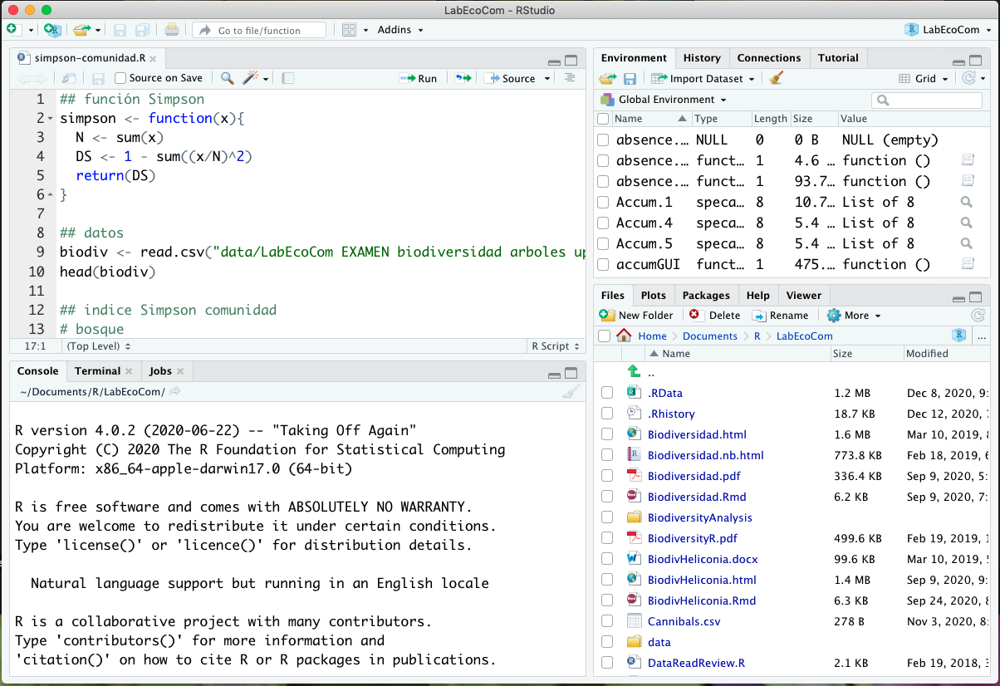

```{r setup, include=FALSE}
knitr::opts_chunk$set(echo = TRUE)
```

## 1.1. R y RStudio
En este módulo vamos a definir y diferenciar R y RStudio


### 1.1.1. R
Al finalizar esta sección podrás describir las características de R y al menos dos de sus ventajas para los cursos universitarios.

#### ¿Qué es R?
_La respuesta depende de a quién se le pregunte._


Como vemos en la imagen, la respuesta puede depender del tipo de interacción que tengamos con R y sus aplicaciones.

La respuesta oficial la puede encontrar en el sitio de R: R-project.  R es un lenguaje de programación de código abierto (open source) y además un ambiente para realizar procedimientos estadísticos (Beckerman & Petchey, 2012).  Incluye facilidades de programación para manejo de datos, realizar cálculos y construir gráficas (Venables et al., 2017).  


__Referencias__

Beckerman, A. P., & Petchey, O. L. (2012). Getting Started with R.  An Introduction for Biologists (First Edition). Oxford University Press; UK

Venables, W. N., Smith, D. M., & R Core Team. (2017). An Introduction to R. http://colinfay.me/intro-to-r/

[  __Home__](https://dsfernandez.github.io/tallerRbasico/index.html)

*** 

### 1.1.2. RStudio
Al finalizar esta sección podrás describir las características de RStudio y al menos dos ventajas de su uso.

#### RStudio IDE
_La interfaz (IDE) más completa y utilizada para R._

__RStudio__ es un entorno de desarrollo integrado (IDE) para __R__. Incluye una consola, editor inteligente de sintaxis que admite la ejecución directa de código, así como herramientas para mostrar gráficas, llevar el historial de trabajo, la depuración de código y la gestión del espacio de trabajo.



Al igual que R, su uso personal es gratis, y facilita el uso (y re-uso) de los códigos en lenguaje R, proveyendo diversas herramientas, que facilitan el trabajo, tanto dentro de la computadora, como conectándose con otros entornos de trabajo y almacenamiento de códigos y datos (RStudio Cloud, GitHub, Rpubs, APIs).

__Referencias__

RStudio. (n.d.). Retrieved July 17, 2020, from https://rstudio.com/products/rstudio/

[  __Home__](https://dsfernandez.github.io/tallerRbasico/index.html)

***  

### 1.1.3. Instalación de R y RStudio
Al finalizar esta sección tendrás instalados los programas R y RStudio en tu computadora.

#### Instrucciones generales para descargar e instalar R y RStudio

<iframe width="560" height="315" src="https://www.youtube.com/embed/-sryC9wgHvU" frameborder="0" allow="accelerometer; autoplay; encrypted-media; gyroscope; picture-in-picture" allowfullscreen></iframe>

Para problemas con la instalación o descarga de R y RStudio puede buscar información en los sitios oficiales de apoyo:  

* [ __R__ ](https://cran.r-project.org/faqs.html)  

* [ __RStudio__ ](https://rstudio.com/products/rstudio/download/)

*** 

[  __Home__](https://dsfernandez.github.io/tallerRbasico/index.html)


